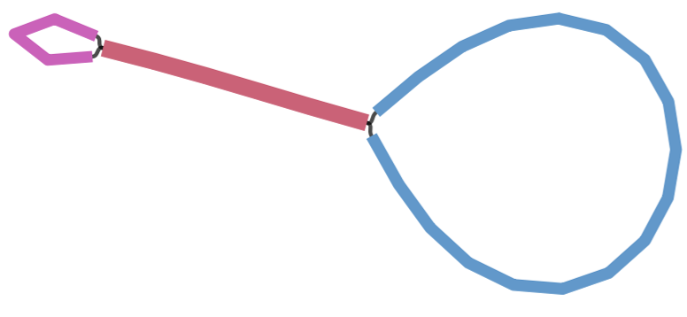
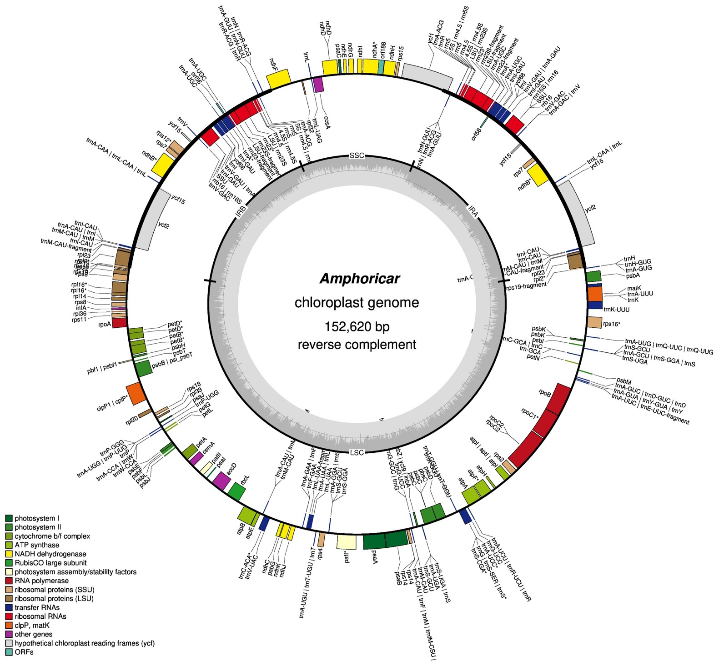
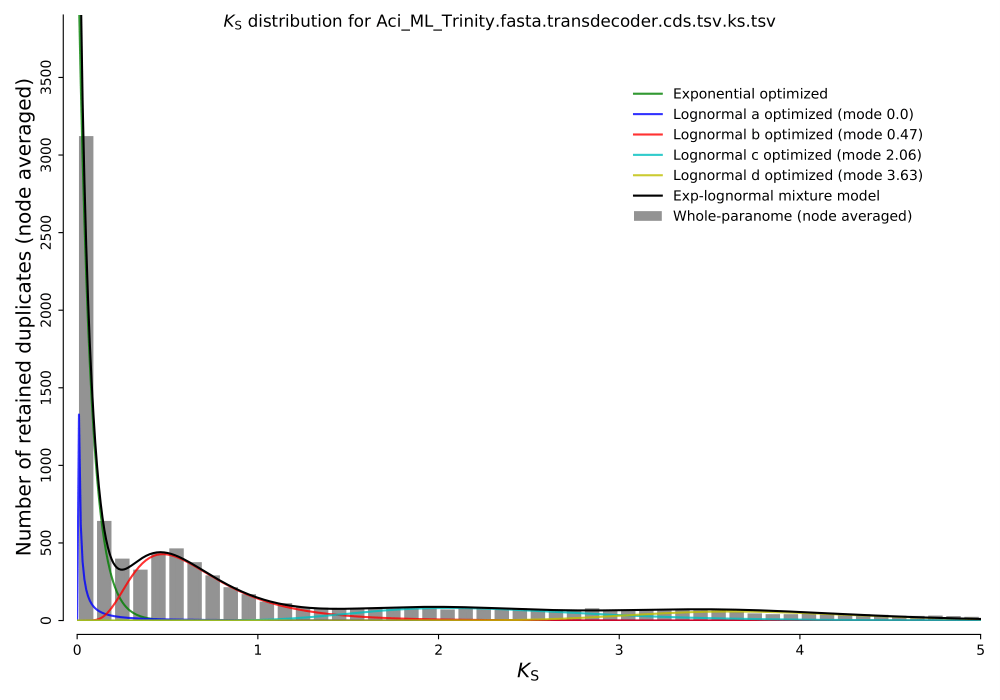

```{js logo-uofm, echo=FALSE}
$(document).ready(function() {
  $('#header').parent().prepend('<div id=\"logo\"></div>');
  $('#header').css('margin-right', '200px')
});
```


```{r packages, echo=FALSE, warning=FALSE, include=FALSE}
library(knitr)
library(rmarkdown)
library(bookdown)
#library(distill)
library(knitcitations)
library(formatR)
library(devtools)
library(kfigr)
library(dplyr)
library(kableExtra)
library(tufte)
require(leaflet)

library(magick)
library(pafr, quietly=TRUE)
#library("gplots")
#library(SNPRelate)
#library(gdsfmt)
library(R.utils) # This package is used to uncompress vcf.gz file
library(seqinr)
#library(RCircos)

#Generate BibTex citation file for all R packages used to produce report
knitr::write_bib(.packages(), file = 'packages.bib')
```

# Introduction

Recent advances in phylogenetic network methods now allow for the estimation of ancient hybridization. Using Hyb-Seq and transcriptomic data from ~300 species within the family Asteraceae, the sunflower family, this study explores how these reticulations intersect with other evolutionary processes, such as polyploidy and whole-genome duplication events, and assesses the impact of taxon selection on these analyses. Given the complexity of these bioinformatic approaches, a tutorial was developed to guide researchers through these methodological processes, making it applicable to other study systems. Alongside a growing body of research, this study underscores the role of gene flow, hybridization, and introgression in speciation. Further advancements in bioinformatic approaches will continue to enhance theoretical studies in the field of plant evolution. 

This tutorial may serve as a template for researchers aiming to investigate the complex evolutionary processes that influence the diversity of life. Researchers may contact ermoore3@memphis.edu or pllestad@memphis.edu regarding questions in methodology. This pipeline implements code in multiple languages, mainly bash, R, python, and julia, and often uses conda as a way to quickly and cleanly install packages on a HPC. 

To use conda environments on a Linux system, install miniconda3 following the steps below. 

```{bash echo = T, eval = F}
#bash
# copy the bash script needed to install miniconda3
wget https://repo.anaconda.com/miniconda/Miniconda3-latest-Linux-x86_64.sh 
 # run the bash script to actually install
bash ~/Miniconda3-latest-Linux-x86_64.sh
# activate your installer
source ~/miniconda3/bin/activate 
# make miniconda3 automatically load every time you join your HPC
conda init --all 
```

# Preparing sequence data 

## Assessing raw sequence quality

FastqQC (https://www.bioinformatics.babraham.ac.uk/projects/fastqc/) is a tool that can spot potential problems in high throughput sequencing datasets. Input can be raw or trimmed sequence files in fastq or bam format. The result of FastQC is an html report which summarises the sequence quality of your samples.

### Installing FastQC

Install FastQC using bioconda with the following code:

```{bash echo = T, eval = F}
#bash
# Install program with Bioconda
conda create --name fastqc
conda activate fastqc
conda install -c bioconda fastqc
```

### Running FastQC

**INPUT**

* Raw sequence files in fastq of bam format, zipped or unzipped. 

If you have many files, you can run it as a loop. For example, with fastq files:
 
```{bash echo = T, eval = F}
#bash
for filename in *.fastq
do
fastqc $filename
done
```

**OUTPUT**

* html file

This html file can be opened through any web browser. A great resource to better understand the report can be found at https://hbctraining.github.io/Intro-to-rnaseq-hpc-salmon/lessons/qc_fastqc_assessment.html.

## Trimming sequence data

Trimmomatic [@Bolger2014] is a read trimming tool that removes Illumina adapters from low-quality bases and adapter contamination. It’s important to do this step first to make sure you have cleaned and trimmed data going forward.

### Installing Trimmomatic

Installation instructions can be found at http://www.usadellab.org/cms/?page=trimmomatic.

### Running Trimmomatic

**INPUT**

* Paired end raw sequence files in fastq format. 

After installation, the java script needed to run Trimmomatic should be in a folder such as ‘Trimmomatic-0.36’. Go into your folder containing the sequence files and run Trimmomatic in a loop on all paired end fastq files (here ending in R1.fastq and R2.fastq) using the following code:

```{bash echo = T, eval = F}
#bash
for fileR1 in *R1.fastq
do
fileR2=`echo ${fileR1} | sed 's/R1/R2/'`
java -jar /PATH/TO/Trimmomatic-0.36/trimmomatic-0.36.jar PE $fileR1 $fileR2 $fileR1.tp.fastq $fileR1.tunp.fastq $fileR2.tp.fastq $fileR2.tunp.fastq ILLUMINACLIP:/PATH/TO/Trimmomatic-0.36/adapters/TruSeq3-PE.fa:2:30:10 LEADING:20 TRAILING:20 SLIDINGWINDOW:5:20 MINLEN:36
done
```

One common change made to the script is changing the values for ILLUMINACLIP, LEADING, TRAILING, SLIDINGWINDOW, and MINLEN. Please refer to the GitHub or primary literature to determine which values best fit your data.

**OUTPUT**

* *.tp.fastq, the trimmed sequence data
* *.tunp.fastq, the sequence data removed from trimming

[Optional] Re-run FastQC on the trimmed sequence data to see if the quality improved from trimming!

# Assembling Sequence Data

This tutorial will cover different sequence assembly methods including SPAdes [@Prjibelski2020] for genome assembly using target-enriched sequence data, GetOrganelle [@Jin2020] for chloroplast assembly using off-target reads from target-enriched sequence data, and Trinity [@Grabherr2011] for transcriptome assembly of RNA sequence data.  

## Assembling genomes from target-enriched sequencing data

SPAdes [@Prjibelski2020] is a versatile toolkit designed for assembly and analysis of sequencing data and was primarily developed for Illumina sequencing data.

### Installing SPAdes

Installation instructions can be found at https://github.com/ablab/spades.

### Running SPAdes

**INPUT**

* *.tp.fastq, the trimmed sequence data

```{bash echo = T, eval = F}
#bash
for trimR1 in `find ./ -name "*R1.fastq.tp.fastq"`    
do
trimR2=`echo ${trimR1} | sed 's/R1/R2/'`
/PATH/TO/bin/spades.py -k 21,33,55,77,99 --only-assembler --pe1-1 $trimR1 --pe1-2 $trimR2 -o ./$trimR1.spades_output 
done

PAIGE- does this renaming need to be here
# Rename spade output folder making it short having only sample name
for i in *;
do
mv "./$i" "./$(echo $i |grep ".fastq.spades_output"| awk '{split($0,a,"_");print a[1]}')"
done

# copy all the contig files with the sample name in a folder named ‘contigs’
mkdir ../contigs
for f in *;
do
cp "$f/contigs.fasta" "./contigs/$f.fasta";
done
```

**OUTPUT**
PAIGE add more info here

* *.fasta: contig files

## Assembling transcriptomes from RNA-seq data

Trinity [@Grabherr2011] represents a novel method for the efficient and robust de novo reconstruction of transcriptomes from RNA-seq data. 

### Installing Trinity

Installation instructions can be found at https://github.com/trinityrnaseq/trinityrnaseq/wiki.

### Running Trinity

**INPUT**

* *.tp.fasta, trimmed RNA-sequence data PAIGE need to add trimming for rna seq data into pipeline

```{bash echo = T, eval = F}
#bash
 Trinity --seqType fq --left reads_1.fq --right reads_2.fq --CPU 6 --max_memory 20G 
PAIGE find out what the code actually was
```

**OUTPUT**

* *.fasta: assembled transcripts in fasta format

## Assembling chloroplast genomes from target-enriched sequencing data

Organellar sequences may be extracted from off-target sequence reads and assembled using GetOrganelle (https://github.com/Kinggerm/GetOrganelle) [@Jin2020]. Often, there will not be enough off-target sequence data for complete organellar assembly. The integrity of complete chloroplast assemblies may be assessed using Bandage [@Wick2015], then annotated using GeSeq [@Tillich2017].

### Installing GetOrganelle

```{bash echo = T, eval = F}
#bash
conda create --name getorganelle
conda activate getorganelle
conda install -c bioconda getorganelle
```

### Running GetOrganelle

**INPUT**

* *.tp.fastq, the trimmed sequence data

```{bash echo = T, eval = F}
#bash
conda activate getorganelle
get_organelle_from_reads.py -1 forward.fq -2 reverse.fq -o plastome_output -R 15 -k 21,45,65,85,105 -F embplant_pt
```

Other parameters may be adjusted to support the successs of a complete plastome assembly. I prefer to increase the number of rounds (-R), double the disentangle time limit (--disentangle-time-limit 7200), then possibly decrease the word size (-w) based on the default word size found in the log file. Refer to https://github.com/Kinggerm/GetOrganelle for more parameter adjustments. 

**OUTPUT**

* *.path_sequence.fasta, the plastome assembly
* *.selected_graph.gfa, the organelle-only assembly graph
* Additional output is described at https://github.com/Kinggerm/GetOrganelle

### Installing Bandage

Check integrity of plastome assembly with Bandage [@Wick2015] using the file "*.selected_graph.gfa" as input. Bandage can be downloaded as a GUI executable for Mac or Windows but can also be run command-line on Linux systems using the following code from https://github.com/rrwick/Bandage/wiki/Command-line.

```{bash echo = T, eval = F}
#bash
#Upload to your HPC
wget https://github.com/rrwick/Bandage/releases/download/v0.8.1/Bandage_Ubuntu_dynamic_v0_8_1.zip

unzip Bandage_Ubuntu_dynamic_v0_8_1.zip
```

### Running Bandage

**INPUT**

* *.selected_graph.gfa, output from GetOrganelle

```{bash echo = T, eval = F}
#bash
for file in *.p_ctg.gfa;
do
~/Bandage image $file $file.jpg;
done
```

**OUTPUT**

* visualizations may be exported in multiple formats

```{r bandage, echo=FALSE, fig.cap="Bandage visualization of contig structure of plastome assembly for Amphoricarpus autariatus. A complete plastome assembly should show this structure representing the 4 quadripartite regions of the plastome: a large circle representing the large single copy region, a small circle representing the small single copy region, and and a connecting line representing the two inverted repeat regions.", out.width = '100%'}

```

### Running GeSeq

GeSeq [@Tillich2017] is a web-based applicaion that was developed for the rapid and accurate annotation of organelle genomes, in particular chloroplast genomes. Complete circular plastome assemblies may be annotated using GeSeq [@Tillich2017] and visualized using OGDraw at https://chlorobox.mpimp-golm.mpg.de/geseq.html. 

```{r ogdraw, echo=FALSE, fig.cap="Annotated chloroplast of Amphoricarpos autariatus produced by OGDraw.", out.width = '100%'}

```


# Generating Species Phylogenies

## Identifying ultra-conserved elements from target-enriched data

PHYLUCE [@Faircloth2016] is a software that determines orthology from targeted loci/genes (e.g., from target-enrichment data). It is considered ‘ultra-conserved’ compared to other orthology determination softwares (e.g., HybPiper) since it removes any loci that is considered paralogous. Other poeple use hybpiper blah blah , skip down to blah model selection section use your concatenate gene file . PAIGE

### Installing Phyluce

```{bash echo = T, eval = F}
#bash
conda create --name phyluce
conda activate phyluce
conda install bioconda::phyluce
```

### Running PHYLUCE

**INPUT**

* contigs/*.fasta, folder containing all contig files (output from SPAdes)
*	datasets.conf, a file containing a list of species used in the analysis. Species names should be separated by "_". When using this, you need to reference which species you want to refer to by indicating it with the ‘taxon-group’ flag.
*	phyluce_cos1061_probes.fasta: the probe file with gene names and sequences from targeted genes. PAIGE for our probe set, this can be downloaded from erikas github....

NOTE: Make sure to change the file paths throughout and change the number of taxa to the appropriate number at each '--taxa' flag when needed.

```{bash echo = T, eval = F}
#bash
#activate the conda environment
conda activate phyluce

# Create empty log folder
mkdir ./log

# Generate *.lastz files for each contig from SPAdes.
python /home/USER/miniconda3/envs/phyluce/bin/phyluce_assembly_match_contigs_to_probes     --contigs ./contigs     --probes cos_probes.fasta     --output ./output     --log-path ./log

#Resulting files are *.lastz files in the ‘output’ folder. These files only need to be made once and are only probe–not species–specific.

# Create empty output directory, in this case it is called ‘taxon-set-all’
mkdir ./taxon-set-all/

#PAIGE what is done here
python /home/USER/miniconda3/envs/phyluce/bin/phyluce_assembly_get_match_counts     --locus-db ./output/probe.matches.sqlite     --taxon-list-config datasets.conf     --taxon-group 'subset4'     --output ./taxon-set-all/all.conf     --incomplete-matrix     --log-path ./log

#PAIGE what is done here
python /home/USER/miniconda3/envs/phyluce/bin/phyluce_assembly_get_fastas_from_match_counts  --contigs ./contigs   --locus-db ./output/probe.matches.sqlite --match-count-output ./taxon-set-all/all.conf --incomplete-matrix ./taxon-set-all/all.incomplete --output ./taxon-set-all/all.fasta --log-path ./log

# Explode the monolithic FASTA
python /PATH/TO/miniconda3/envs/phyluce/bin/phyluce_assembly_explode_get_fastas_file --input ./taxon-set-all/all.fasta --output exploded-fastas

# Then run the below code to get stats
for i in exploded-fastas/*.fasta;
do
python /PATH/TO/miniconda3/envs/phyluce/bin/phyluce_assembly_get_fasta_lengths --input $i --csv;
done > fasta_lengths.csv
#the resulting csv has summary stats on the FASTAS
#the column headers are: samples,contigs,total bp,mean length,95 CI length,min length,max length,median length,contigs >1kb

# Alignment without internal trimming BUT does edge trim 
#CHANGE TAXON NUMBER
python /PATH/TO/miniconda3/envs/phyluce/bin/phyluce_align_seqcap_align --input ./taxon-set-all/all.fasta  --output ./taxon-set-all/mafft-nexus-trimmed/ --taxa 11 --aligner mafft --cores 4 --incomplete-matrix --log-path ./log

# Get basic stats on the alignments  
python /PATH/TO/miniconda3/envs/phyluce/bin/phyluce_align_get_align_summary_data --alignments ./taxon-set-all/mafft-nexus-trimmed/ --cores 4 --log-path ./log

# Remove locus name from alignments   
python /PATH/TO/miniconda3/envs/phyluce/bin/phyluce_align_remove_locus_name_from_files --alignments ./taxon-set-all/mafft-nexus-trimmed/ --output ./taxon-set-all/mafft-nexus-trimmed-clean/ --log-path ./log

# Generates individual gene matrix files that will be used for the pseudo-coalescent analysis
#CHANGE TAXON NUMBER
python /PATH/TO/miniconda3/envs/phyluce/bin/phyluce_align_get_only_loci_with_min_taxa --alignments ./taxon-set-all/mafft-nexus-trimmed-clean --taxa 11 --percent 0 --output ./taxon-set-all/mafft-nexus-trimmed-clean-genes --cores 4 --log-path ./log

# Build the total concatenated data matrix from the gene matrices
python /PATH/TO/miniconda3/envs/phyluce/bin/phyluce_align_concatenate_alignments --alignments ./taxon-set-all/mafft-nexus-trimmed-clean-genes --output ./taxon-set-all/mafft-nexus-trimmed-raxml --phylip --log-path ./log

# Converts nexus to phylip-relaxed file format
python /PATH/TO/miniconda3/envs/phyluce/bin/phyluce_align_convert_one_align_to_another --alignments ./taxon-set-all/mafft-nexus-trimmed-clean-genes --output ./taxon-set-all/mafft-fasta --input-format nexus --output-format phylip-relaxed --cores 1 --log-path ./log
```

**OUTPUT**

* fasta_lengths.csv, summary stats on all sequences 
*	./Exploded_fastas/,  folder containing unaligned sequence data used to generate the summary statistics (fasta_lengths.csv)
*	./Taxon_set_all/
+	all.conf, logs which taxa and genes were recovered with PHYLUCE
+	all.fasta,  all gene sequences that matched the probe set for each taxon as a multifasta file
+	all.incomplete, lists all genes that did not match the probe set for each taxon
+	mafft-nexus-trimmed/, folder containing all aligned sequences without internal trimming BUT does edge trim
+	mafft-nexus-trimmed-clean/, folder similar to ‘mafft-nexus-trimmed/’ but removed the locus name from the alignment
+	mafft-nexus-trimmed-clean-genes/, folder containing gene files that will be used for pseudo-coalescent analysis
+	mafft-nexus-trimmed-raxml/, folder containing the concatenated gene matrix of all genes and taxa along with a ‘charsets’ file that will be used for model selection
+	mafft-fasta/, folder similar to ‘mafft-nexus-trimmed-raxml/’ but has the files as phylip-relaxed instead of nexus

(Optional) Extracting data from the sqlite database produced by PHYLUCE
PHYLUCE produces a sqlite database that contains two tables: “matches” and “match_map”. “matches” contains which loci were recovered for each taxa, while “match_map” has the name of the contig that matches each loci in each taxa. We can use the following commands to save these tables as csv files.

PAIGE make following navigable\

1. First, navigate to the PHYLUCE output/ folder. The sqlite file ( probe.matches.sqlite) should be there.
2. Next, you want to open the file:
sqlite3 probe.matches.sqlite
3. You should now have sqlite> in your working line. 
NOTE: With the code below, the "sqlite>" bit is the prompt, you don't need to type it down. Type one command at a time and hit enter.
sqlite> .headers on  
sqlite> .mode csv
sqlite> .output matches.csv #creates the first file
sqlite> SELECT * FROM matches;  #populate the file with the contents of the matches table
sqlite> .output match_map.csv #creates the second file
sqlite> SELECT * FROM match_map; #populate the file with the contents of the match_map
sqlite> .quit #exits sqlite
4. Now you should have two files, matches.csv and match_map.csv, in your output folder. These files can be downloaded to get more stats on your PHYLUCE run.


## Model Selection

These next few steps will detail how to run PartitionFinder [@Lanfear2016] to determine which evolutionary model best fits our data to then generate gene trees. 

### Installing PartitionFinder

Installation instructions can be found at www.robertlanfear.com/partitionfinder/tutorial.

### Running PartitionFinder

**INPUT**

* *.phylip, tree file (output from Phyluce)
* *.charsets, character set file (output from Phyluce)

Using the charsets file, create a configuration (.cfg) file with information about the matrix. You may use the following command to make this file. 

```{bash echo = T, eval = F}
#bash
#code to change charsets file to cfg file PAIGE erika did it 
```

Using the newly made .cfg file, run the following code:

```{bash echo = T, eval = F}
#bash
/PATH/TO/PartitionFinder.py /PATH/TO/partition_finder.cfg --raxml --rcluster-max 100 --no-ml-tree
```

**OUTPUT**

* log.txt, log file 
* analysis/best_scheme.txt, file listing loci along with their corresponding best model. 


## Concatenated Phylogeny

When analyzing target-enriched sequencing data for phylogenetic analyses, multiple approaches may be implemented. For a concatenated approach all gene sequences are combined into a single matrix. This method assumes that all trees share the same evolutionary history, and therefore may not always be ideal for ancient divergences where gene trees are highly divergent. This tutorial presents instructions for a concatenated phylogeny using RAxML [@Stamatakis2014], a maximum likelihood phylogenetic inference tool. Phylogenetic trees may be visualized by an array of tools, eg. FigTree (http://tree.bio.ed.ac.uk/software/figtree/).

### Installing RAxML

Installation instructions can be found at https://cme.h-its.org/exelixis/web/software/raxml/cluster.html.

### Running RAxML on a concatenated matrix

**INPUT**

* *.phylip, tree file (output from Phyluce)

Note: Change the -m function depending on the best fitting model (GTR model: GTRCAT; GTR+G model: GTRGAMMA; GTR+I+G model: GTRGAMMAI).

```{bash echo = T, eval = F}
#bash
/PATH/TO/raxmlHPC-PTHREADS-SSE3 -T $SLURM_CPUS_PER_TASK -f a -p 12345 -x 12345 -m GTRGAMMAI -# 100 -s /PATH/TO/mafft-nexus-trimmed-raxml.phylip -n out
```

**OUTPUT**

*RAxML_bipartitionsBranchLabels.out
*RAxML_bootstrap.out
*RAxML_info.out
*RAxML_bestTree.out
*RAxML_bipartitions.out

### Installing FigTree

Installation instructions can be found at https://evomics.org/resources/software/molecular-evolution-software/figtree/.

**INPUT**

* RAxML_bipartitionsBranchLabels.out, output from RAxML

**OUTPUT**

* visualizations may be exported in multiple formats

```{r concat_tree, echo=FALSE, fig.cap="Phylogenetic tree produced from RAxML analysis on a concatenated matrix visualized using FigTree.", out.width = '100%'}
#PAIGE replace with smaller tree

```

## Coalescent-based Phylogeny

In contrast to a concatenated approach, a coalescent phylogenetic approach analyzes individual gene tree, accounting for the fact that different genes may have different evolutionary histories. This method may be better suited for resolving phylogenetic relationships in the presence of incomplete lineage sorting and hybridization, but is more computationally demanding than concatenated methods. One method to generate a coalescent phylogeny is by using Astral-III [@Zhang2018] on a suite of RAxML [@Stamatakis2014] gene trees constructed under different models. Resulting phylogenetic trees may be visualized by an array of tools, eg. FigTree (http://tree.bio.ed.ac.uk/software/figtree/).

### Installing RAxML

Installation instructions can be found at https://cme.h-its.org/exelixis/web/software/raxml/cluster.html.

### Running RAxML for coalescent analyses

When running RAxmL for a pseudo-coalescent (hereafter referred to as “ASTRAL”) analysis, you should separate the individual loci by their most appropriate model as indicated by the results of PartitionFinder and run each loci separately.

**INPUT**

* uce-*.nexus, individual loci file in nexus format (output from Phyluce)
* analysis/best_scheme.txt, file denoting the best model for each loci (output from Phyluce)

To organize all loci files into new directories pertaining to each model type, you can use the following code. In this code, loci files (eg. uce-*.nexus) will be moved into folders labeled "batch_exports".

```{bash echo = T, eval = F}
#bash
#make folders of each model type in main working directory
mkdir astral_raxml
cd astral_raxml

mkdir bestTree
mkdir bootTree
mkdir Astral_try

mkdir GTR
mkdir GTRG
mkdir GTRIG
cd GTR
mkdir GTR_batch_exports
mkdir output
cd ../GTRG
mkdir GTRG_batch_exports
mkdir output
cd ../GTRIG
mkdir GTRIG_batch_exports
mkdir output

#edit the best_scheme.txt file to be used for designating loci files to proper model folder
tail -n +22 best_scheme.txt| sed -n '/^$/q;p' > best_scheme_uce_table.txt
```

Move each loci folder to its designated model folder using the following R code. Change the uce location paths to match your own directory organization.

```{bash echo = T, eval = F}
#R

df <- read.table(file = "best_scheme_uce_table.txt", header = TRUE, sep = "|", na.strings = "", comment.char = "", quote = "\"", fill = FALSE, nrows = 200000)

df$Best.Model <- gsub(" ", "", df$Best.Model, fixed = TRUE)
df$Partition.names <- gsub(" ", "", df$Partition.names, fixed = TRUE)

GTR <- c(unlist(strsplit(df$Partition.names[which(df$Best.Model == "GTR")],",")))
GTRG <- c(unlist(strsplit(df$Partition.names[which(df$Best.Model == "GTR+G")],",")))
GTRIG <- c(unlist(strsplit(df$Partition.names[which(df$Best.Model == "GTR+I+G")],",")))

model_GTR <- cbind(GTR, rep("GTR", n= length(GTR)))
model_GTRG <- cbind(GTRG, rep("GTRG", n= length(GTRG)))
model_GTRIG <- cbind(GTRIG, rep("GTRIG", n= length(GTRIG)))

model_df <- as.data.frame(rbind(model_GTR, model_GTRG, model_GTRIG))
colnames(model_df) <- c("uce", "model")


uce_original_location <- "/PATH/TO/taxon-set-all/mafft-nexus-trimmed-clean-100p/"
uce_model_location <- "/PATH/TO/astral_raxml/"
files <- list.files(uce_original_location)

for(i in 1:length(files)) {
  
  file_name <- files[i]
  file_uce <- gsub(".nexus", "", file_name)
  file_model <- model_df$model[which(model_df$uce %in% file_uce)]
  file.copy(from = paste(uce_original_location, file_name, sep = ""),to = paste(uce_model_location, file_model, "/", file_model, "_batch_exports", sep = ""))
  
}
```

Once all the gene files ARE in their appropriate model choice’s batch_export/ folder, the file type and ending will need to be changed from .nexus to .fasta. This can be doe using the tool ElConcatenero (https://github.com/ODiogoSilva/TriFusion) using the following code. 

```{bash echo = T, eval = F}
#bash
python /home/USER/ElConcatenero/ElConcatenero.py -c -if nexus -of fasta -in *.nexus
```

RAxML can then be run on the individual, aligned gene files in a loop. The -m flag will need to be adjusted depending on the best fitting model (GTR model: GTRCAT; GTR+G model: GTRGAMMA; GTR+I+G model: GTRGAMMAI).

```{bash echo = T, eval = F}
#bash
DIR_I=/PATH/TO/astral_raxml/GTR/batch_exports/*

for f in $DIR_I
do
echo "Processing $f"
file_name=$(basename $f)
/PATH/TO/raxmlHPC-PTHREADS-SSE3 -T 4 -f a -p 12345 -x 12345 -m GTRCAT -# 100 -s $f -n $file_name -w /PATH/TO/astral_raxml/GTR/output
done
```

**OUTPUT**

* /output/RAxML_bootstrap*, bootstrap files for each model type
* /output/RAxML_bestTree*, best tree files for each model type

Output from these RAxML [@Stamatakis2014] analyses will be used as input for the Astral-III [@Zhang2018] analysis. 

### Installing ASTRAL-III

Installation instructions can be found at https://github.com/smirarab/ASTRAL.

### Running ASTRAL-III

**INPUT**

* RAxML_bestTree*, tree files (output from RAxML)
* RAxML_bootstrap*, bootstrap files (output from RAxML)

After the output files are produced from RAxML, copy the RAxML_bestTree* and RAxML_bootstrap* files into their own folders. The file endings will then need to be changed and they will need to be concatenated. The following code may be used to prepare files for the ASTRAL analysis. 

```{bash echo = T, eval = F}
#bash
#make new folders
cd /PATH/TO/astral_raxml/
mkdir bestTree
mkdir bootTree

#copy files to new folders
cp /PATH/TO/GTR/output/RAxML_bootstrap* ./bootTree/
cp /PATH/TO/GTR/output/RAxML_bestTree* ./bestTree/

#change fasta extension to .tre extension
cd bestTree
for f in *.fasta; do
mv -- "$f" "${f%.fasta}.tre"
done
cd bootTree
for f in *.fasta; do
mv -- "$f" "${f%.fasta}.tre"
done

#concatenate the .tre files
cd bestTree
cat RAxML_bestTree* > concat_best.tre 

#make a new folder named Astral and copy the concatenated best tree file into it
cd /PATH/TO/astral_raxml/
mkdir Astral_try
cd Astral_try
cp ../bestTree/concat_best.tre .
```

(Optional) We have stopped doing bootstrap analyses since the creators of ASTRAL-III said that LPP support values are more reliable than bootstrap, but the code is provided if you would like to do it. If you are running a bootstrap analysis, you also need to make a bs-files file which designates where the RAxML_bootstrap*.tre files are (e.g., bootTree/).

```{bash echo = T, eval = F}
#example bs_files

/PATH/TO/astral_raxml/bootTree/RAxML_bootstrap.uce-1000.tre
/PATH/TO/astral_raxml/bootTree/RAxML_bootstrap.uce-1005.tre
/PATH/TO/astral_raxml/bootTree/RAxML_bootstrap.uce-1007.tre
/PATH/TO/astral_raxml/bootTree/RAxML_bootstrap.uce-1008.tre
# remaining bootstrap file locations
```

Code to make this bs-files is below.

```{bash echo = T, eval = F}
#bash
cd /PATH/TO/astral_raxml/bootTree/
ls *.tre > bs-files
pwd #copy the directory!
sed -i 's\RAxML\==/PATH/TO/astral_raxml/bootTree/==RAxML\g' bs-files #paste your working directory where it is highlighted!
mv bs-files ../Astral_try/
```

ASTRAL-III can now be run with the following code:

```{bash echo = T, eval = F}
#bash
#Run ASTRAL
java -jar /PATH/TO/ASTRAL/astral.5.7.3.jar  -i concat_best.tre -o Astral_best.tre 2> astral_best.log

#Generate LPP values
java -jar /PATH/TO/ASTRAL/astral.5.7.3.jar  -q Astral_best.tre  -i concat_best.tre -o Astral_lpp.tre 2> astral_lpp.log

#Get bootstrap values (optional)
java -jar /PATH/TO/ASTRAL/astral.5.7.3.jar  -i concat_best.tre -b bs-files -o Astral_bootcount.tre 2> astral_bootcount.log
```

**OUTPUT

* *.log, log file
* Astral.lpp.tre, final tree with LPP support values.

### Installing FigTree

Installation instructions can be found at https://evomics.org/resources/software/molecular-evolution-software/figtree/.

**INPUT**

* Astral.lpp.tre, output from ASTRAL-III

**OUTPUT**

* visualizations may be exported in multiple formats

```{r astral_tree, echo=FALSE, fig.cap="Phylogenetic tree produced from ASTRAL-III analysis visualized using FigTree.", out.width = '100%'}
#PAIGE replace with smaller tree

```

## Orthology-based Phylogeny 

Another tool for generating phylogenetic trees within a coalescent framework is OrthoFinder [@Emms2019]. This program identifies orthogroups, infers rooted trees for all orthogroups, identifies gene duplication events, and infers a rooted species tree. 

PAIGE this whole section needs to be done

### Installing OrthoFinder

```{bash echo = T, eval = F}
#bash
# Install program with Bioconda
conda create --name orthofinder
conda activate orthofinder
conda install -c bioconda orthofinder
```

### Running OrthoFinder

**INPUT**

```{bash echo = T, eval = F}
#bash

```

**OUTPUT**

Refer to https://davidemms.github.io/orthofinder_tutorials/exploring-orthofinders-results.html for more detailed description of results. 

## Chloroplast Phylogeny

PAIGE also add cophylo to the visualization section

Phylogenetic trees from chloroplast sequencing data can be generated in a number of different ways. This tutorial will describe a method for plastome phylogenetic reconstruction using target-enriched sequencing data. As mentioned above in the plastome assembly seciton (PAIGE figure out how to link to dif sections), there will often not be enough off-target sequence data for complete organellar assembly.

### Installing Bowtie2, Samtools, BCFtools, seqtk

```{bash echo = T, eval = F}
#bash
# Install program with Bioconda
conda create --name mapping
conda activate mapping
conda install bioconda::bowtie2
conda install bioconda::samtools
conda install bioconda::bcftools
conda install bioconda::seqtk
```

**INPUT**

* *.tp.fastq, the trimmed sequence data

### Running Bowtie2, Samtools, BCFtools, seqtk

This tutorial will describe a process of mapping off-target sequence reads to a reference plastome in order to create consensus sequences which may then be aligned and used as input for phylogenetic analyses.  

**INPUT**

* reference.fasta, a reference plastome can be downloaded from GenBank or used from previous GetOrganelle analyses
* *.tp.fastq, the trimmed sequence data for all samples

First, a reference database will need to be constructed using Bowtie2. This can be done using the following code:

```{bash echo = T, eval = F}
#bash
conda activate mapping

bowtie2-build reference_plastome.fasta reference_plastome
```

After a reference database has been built, the paired end target-enriched sequence reads may be mapped on to the reference plastome. To do this in a loop with all reads with file endings "_1_tp.fastq" and "_2_tp.fastq", use the following code:

```{bash echo = T, eval = F}
#bash
conda activate mapping

#in your working directory, make folders for output of this pipeline
mkdir sam_files
mkdir bam_files
mkdir fastq
mkdir consensus_fastas

#run the pipeline in a loop on all paired files
for fileR1 in *_1_tp.fastq
do
fileR2=`echo ${fileR1} | sed 's/_1_/_2_/'`
filename=`echo ${fileR1} | sed 's/_1_.*//'`

#map reads to reference plastome
bowtie2 --very-sensitive -p 24 -x /PATH/TO/reference_plastome -1 "$fileR1" -2 "$fileR2" -S /PATH/TO/sam_files/"$filename".sam

#convert sam files to bam files
cat /PATH/TO/sam_files/"$filename".sam | samtools view -bS - | samtools sort -o /PATH/TO/bam_files/"$filename".bam

#Get consensus fastq file
bcftools mpileup -f /PATH/TO/reference_plastome.fasta /PATH/TO/bam_files/"$filename".bam | bcftools call -c | vcfutils.pl vcf2fq > /PATH/TO/fastq/"$filename"_cns.fastq

#vcfutils.pl is part of bcftools

#Convert .fastq to .fasta 
seqtk seq -a /PATH/TO/fastq/"$filename"_cns.fastq > /PATH/TO/consensus_fastas/"$filename"_cns.fastq
done
```

The scaffold names need to be changed to match the name of the sample. 

```{bash echo = T, eval = F}
#R
files <- list.files(pattern= "fasta")

for (i in 1:length(files)) {
  
  # 2. Set file name
  f <- files[i]
  
  # 3. Load fasta 
  fasta <- readLines(f) 
  
  # replace scaffold name with sample id
  
  id <- gsub("_cns.fasta", "", f)
  
  new_scaf_name <- paste0(">", id)
  
  fasta[1] <- new_scaf_name
  
  # 7. Overwrite consensus file with new scaffold names
  write.table(fasta, paste0(id, "_cns.fasta"), row.names = F, col.names=F, quote = F)
}  
  # 8. Quit R
  quit(save="no")
```
PAIGE add how to calc missing data
Now all of the consensus files can be concatenated and aligned for phylogenetic analysis. In this tutorial, MAFFT [@Katoh2013] will be used to align sequences. 

### Installing MAFFT

Installation instructions can be found at https://mafft.cbrc.jp/alignment/software/source.html. 

### Running MAFFT

Concatenate all sequences and align them using mafft. 

```{bash echo = T, eval = F}
#bash
cd /PATH/TO/consensus_fastas

cat *.fasta > all_cns.fasta

mafft all_cns.fasta > all_cns_aligned.fasta
```

Phylogenetic analyses may be run on the aligned sequences in multiple ways. One user-friendly way is by usi IQTREE [@Minh2020]. Comprehensive instructions on how to run IQTREE can be found at http://www.iqtree.org/doc/iqtree-doc#beginners-tutorial. 


### Installing IQTREE

```{bash echo = T, eval = F}
#bash
conda create --name iqtree
conda activate iqtree
conda install -c bioconda iqtree
```

### Running IQTREE

**INPUT**

* all_cns_aligned.fasta

```{bash echo = T, eval = F}
#bash
conda activate iqtree

iqtree -s all_cns_aligned.fasta -B 1000
```

**OUTPUT**

* *.phy.iqtree: the main report file
* *.phy.treefile: the ML tree
* *.phy.log: log file 

### Installing FigTree

Installation instructions can be found at https://evomics.org/resources/software/molecular-evolution-software/figtree/.

**INPUT**

* *.phy.treefile: ML tree file from IQTREE

**OUTPUT**

* visualizations may be exported in multiple formats

```{r cp_tree, echo=FALSE, fig.cap="Phylogenetic tree produced from RAxML analysis on a concatenated matrix visualized using FigTree.", out.width = '100%'}

```

# Identifying phylogenetic discordance 
ovreview of phylo discordance PAIGE

Phylogenomic incongruence is constantly seen in phylogenomic studies and typically results from underlying gene tree discordance. Below are tutorials on how to investigate the extent of gene tree discordance among phylogenies using PhyParts (Smith et al., 2015), which summarizes how many gene trees agree/disagree with the final species topology, and Quartet Sampling (Pease et al., 2018), which uses quartets to investigate the cause of low support at each node.

## PhyParts

PhyParts [@Smith2015], along with PhypartsPieCharts, are tools that indicate the percentage of concordant gene trees, percentage in the top alternative bipartition, other conflicting topologies, and uninformative genes as pie charts on the nodes of a species phylogeny. In doing so, you gain a better visualization of discordant nodes caused by gene tree conflict. To prepare the input data for PhyParts, Phyx [@Brown2017] can be used to root the species and gene trees produced from Astral-III [@Zhang2018].

## Installing Phyx

Isntallation instructions can be found at https://github.com/FePhyFoFum/phyx. 

## Running Phyx

**INPUT**

* Astral_best.tre: species tree output from Astral-III
* /astral_raxml/bestTree/*.tre: gene tree files output from Astral-III

Phyx [@Brown2017] is a very helpful phylogenetic tool that has many functions. For the purposes of running PhyParts, we only need to use the ‘rerooting and unrooting tree’ function, pxrr. Designating the proper taxa/taxon as outgroups for rooting, the following code may be used:

```{bash echo = T, eval = F}
#bash
#for a single taxon rooting
pxrr -t Astral_best.tre -g outgroup_taxon > Astral_best_rooted.tre 
#for rooting to multiple taxa
pxrr -t Astral_best.tre -g outgroup_taxon1 outgroup_taxon2 outgroup_taxon3 … > Astral_best_rooted.tre 

#running pxrr on the gene trees in a loop 
for t in *.tre
do
pxrr -t $t -g outgroup_taxon > $t.rooted.tre
done

#Not all gene trees may have your outgroup taxon, so the number of gene trees may decrease from what you originally started with. Make sure to remove those empty gene trees. A quick, one liner code you can run to do that is:

find . -maxdepth 1 -type f -empty -print -delete
```

**OUTPUT**

* Astral_best_rooted.tre: rooted species tree
* *.rooted.tre: rooted gene trees

### Installing PhyParts

General installation instructions can be found at https://bitbucket.org/blackrim/phyparts/src/master/, however, code is below to make a conda environment called ‘phyparts’. Additionally, the GitHub repository needs to be cloned to obtain the python scripts to run PhyParts.

```{bash echo = T, eval = F}
#bash
conda create -n phyparts python=2.7
pip install ete3
pip install matplotlib

git clone https://bitbucket.org/blackrim/phyparts.git
```

### Running PhyParts

**INPUT**

* Astral_best_rooted.tre: rooted species tree from Phyx
* *.rooted.tre: rooted gene trees from Phyx

```{bash echo = T, eval = F}
#bash
java -jar /PATH/TO/phyparts/target/phyparts-0.0.1-SNAPSHOT-jar-with-dependencies.jar -a 1 -v -d /PATH/TO/phyluce/PhyParts/root/ -m /PATH/TO/Astral_best_rooted.tre -o output
```

**OUTPUT**

* out.concon.tre
* out.concord.node.1
* out.conflict.node.0
* out.conflict.node.2
* out.hist.alts
* out.concord.node.0
* out.concord.node.2
* out.conflict.node.1
* out.hist
* out.node.key

Detailed information on the ouput of PhyParts can be found at https://bitbucket.org/blackrim/phyparts/src/master/. 

### Running PhyPartsPieCharts

The results of PhyParts are not very figure ready. Fortunately, Matt Johnson (Texas Tech University) has generated a visualization script, called ‘phypartspiecharts.py’, that creates an svg image that can be used in manuscripts. 

**INPUT**

```{bash echo = T, eval = F}
#bash
#copy python code from github
git clone https://github.com/mossmatters/MJPythonNotebooks.git
#activate conda environment
conda activate phyparts

#combine all outfiles from PhyParts
cat *.concord.node.* > phyparts.concord.tre
cat *.conflict.node.* > phyparts.conflict.tre
cat *.hist > phyparts.hist
cat *.hist.alts > phyparts.hist.alts
cat *.node.key > phyparts.node.key
cat *.
concon.tre > phyparts.concon.tre

#Now you just need the rooted species tree (Astral_best_rooted.tre), what the different outfiles can be referred to as (e.g., phyparts), and knowledge on how many gene trees were used (e.g., 1000 gene trees).

/PATH/TO/phyluce/PhyParts/phypartspiecharts.py /Path/TO/phyluce/PhyParts/Astral_best-rooted.newick phyparts 1000 --svg_name phyparts_piechart.svg
```

**OUTPUT**

* *.svg, file containing your tree with pie charts at each node indicating:
+ Blue: concordant
+ Green: the top alternative bipartition
+ Red: all other alternative bipartitions
+ Black: uninformative for that node

```{r phyparts, echo=FALSE, fig.cap="Phylogenetic tree produced from RAxML analysis on a concatenated matrix visualized using FigTree.", out.width = '100%'}
#PAIGE  get image from online https://github.com/mossmatters/MJPythonNotebooks/blob/master/PhyParts_PieCharts.ipynb
#knitr::include_graphics("Images/phyparts.png")
```
## Quartet Sampling

Quartet Sampling (QS) [@Pease2018] is a quartet-based method that was designed to assess the confidence, consistency, and informativeness of internal tree relationships, and the reliability of each terminal branch. QS determines if a phylogeny has a lack of support due to not enough information, discordance from ILS or introgression, or misplaced or erroneous taxa. Three scores are calculated (QC, QD, QI) for each internal branch of the focal tree which together allows different interpretations of the branches, as well as a Quartet Fidelity (QF) score that reports how frequently a taxon is included in concordant topologies. QS efficiently synthesizes phylogenetic tests and offers more comprehensive and specific information on branch support than conventional measures (i.e., bootstrap).

### Installing Quartet Sampling

```{bash echo = T, eval = F}
#bash
#create a conda environment for installation
conda create -n quartetsampling numpy
conda activate quartetsampling
conda install -c bioconda python
conda install -c bioconda raxml-ng 

#clone the GitHub to obtain the python scripts to run Quartet Sampling
git clone https://github.com/FePhyFoFum/quartetsampling.git
```

### Running Quartet Sampling

**INPUT** 

* mafft-nexus-trimmed-raxml.phylip: alignment file (output from Phyluce)
* Astral_best.tre: best tree file without support values (output from Astral-III)

Quartet sampling may be run using the following code with the default parameter values. For more information on adjusting the parameters go to https://github.com/FePhyFoFum/quartetsampling/blob/master/quartetsampling.pdf.

```{bash echo = T, eval = F}
#bash
python /PATH/TO/quartetsampling/pysrc/quartet_sampling.py --tree /PATH/TO/Astral_best.tre --align /PATH/TO/mafft-nexus-trimmed-raxml.phylip --reps 100 --threads 4 --lnlike 2
```

**OUTPUT**

* RESULT.labeled.tre
* RESULT.labeled.tre.freq
* RESULT.labeled.tre.qd
* RESULT.node.counts.csv
* RESULT.run.stats
* RESULT.labeled.tre.figtree
* RESULT.labeled.tre.qc
* RESULT.labeled.tre.qi
* RESULT.node.scores.csv

Each file has great information about the different scores generated by Quartet Sampling. The final tree file that shows all values (QC, QI, QD, and QF) is RESULT.labeled.tre.figtree. This tree file can be put into FigTree to visualize discordance in the tree.

### Installing FigTree

Installation instructions can be found at https://evomics.org/resources/software/molecular-evolution-software/figtree/.

**INPUT**

* RESULT.labeled.tre.figtree: output from Quartet Sampling

**OUTPUT**

* visualizations may be exported in multiple formats

```{r qs_tree, echo=FALSE, fig.cap="Phylogenetic tree produced from RAxML analysis on a concatenated matrix visualized using FigTree.", out.width = '100%'}
#PAIGE add qs example image
#knitr::include_graphics("Images/qs_tree.png")
```

# Investigating Ancient Hybridization

## Phylogenetic networks


# Inferring Whole Genome Duplication

PAIGE overview of ways to identify wGD

## WGDv2

wgd v2 [@Chen2024] is a package that can be used to infer and date ancient whole-genome duplication (WGD) events. This tutorial will describe using wgd v2 exclusively to generate Ks plots to determine the evolutionary age of WGD events using transcriptomic data which are first translated to coding sequences using TransDecoder (https://github.com/TransDecoder/TransDecoder).  

### Installing TransDecoder

Installation instructions can be found at https://github.com/TransDecoder/TransDecoder. PAIGEadd the singularity installation? it is the only one in the whole pipeline. 

### Running TransDecoder

**INPUT**

* assembled transcripts in fasta format (output from Trinity)

```{bash echo = T, eval = F}
#bash
#extract the long open reading frames
TransDecoder.LongOrfs -t assembled_transctipts.fasta --output_dir output

#predict the likely coding regions
TransDecoder.Predict -t assembled_transctipts.fasta --output_dir output 
```

**OUTPUT**

* *.fasta.transdecoder.pep: peptide sequences for the final candidate ORFs; all shorter candidates within longer ORFs were removed.
* *.fasta.transdecoder.cds: nucleotide sequences for coding regions of the final candidate ORFs
* *.fasta.transdecoder.gff3: positions within the target transcripts of the final selected ORFs
* *.fasta.transdecoder.bed: bed-formatted file describing ORF position.

### Installing WGDv2

The wgdV2 repository can be cloned from github then a conda environment can be created.

```{bash echo = T, eval = F}
#bash
#clone repository 
git clone https://github.com/heche-psb/wgd 

#create conda environment and install programs
conda create -n wgdv2 python=3.8
conda activate wgdv2
pip install numpy==1.19.0
pip install wgd==2.0.38
conda install diamond #future dependencies
conda install bioconda::mafft #future dependencies
conda install bioconda::mcl #future dependencies
```

### Running WGDv2

To produce Ks plots from out transcriptomic data, we followed "Pipeline 3: Construction of age distribution and ELMM analysis from GitHub" (https://github.com/heche-psb/wgd). Given this, we will be running three commands–‘dmd’, ‘ksd’, and ‘viz’–on the *.cds files generated from TransDecoder with the transcriptome data.

**INPUT**

* *cds, coding sequence files (output from TransDecoder)

```{bash echo = T, eval = F}
#bash
#Construction of age distribution and ELMM analysis
wgd dmd transcripts.transdecoder.cds -o wgd_dmd
wgd ksd wgd_dmd/transcripts.transdecoder.cds.tsv transcripts.transdecoder.cds -o wgd_ksd
wgd viz -d wgd_ksd/transcripts.transdecoder.cds.tsv.ks.tsv -o wgd_ELMM
```

**OUTPUT**

* wgd_ELMM/
  + *.tsv.ks.tsv.ksd.pdf/svg
  + *.tsv.ks.tsv.spline_node_averaged.pdf/svg
  + *.tsv.ks.tsv.spline_weighted.pdf/svg
  + *.tsv.ks.tsv_peak_detection_node_averaged.pdf/svg
  + *.tsv.ks.tsv_peak_detection_weighted.pdf/svg
  + elmm_*.tsv.ks.tsv_best_models_node_averaged.pdf/svg
  + elmm_*.tsv.ks.tsv_best_models_weighted.pdf/svg
  + elmm_*.tsv.ks.tsv_models_data_driven_node_averaged.pdf/svg
  + elmm_*.tsv.ks.tsv_models_data_driven_weighted.pdf/svg
  + elmm_*.tsv.ks.tsv_models_random_node_averaged.pdf/svg
  + elmm_*.tsv.ks.tsv_models_random_weighted.pdf/svg
  + elmm_BIC_*.tsv.ks.tsv_node_averaged.pdf/svg
  + elmm_BIC_*.tsv.ks.tsv_weighted.pdf/svg

```{r ksplot, echo=FALSE, fig.cap="Phylogenetic tree produced from RAxML analysis on a concatenated matrix visualized using FigTree.", out.width = '100%'}

```
# References

<div id="refs"></div>

# Appendix 1 {.appendix}

Citations of all R packages used to generate this report. 

```{r generateBibliography, eval = T, results="asis", cache = F, echo=F, warning = FALSE, message=FALSE}
library("knitcitations")
cleanbib()
options("citation_format" = "pandoc")
read.bibtex(file = "packages.bib")

``` 
